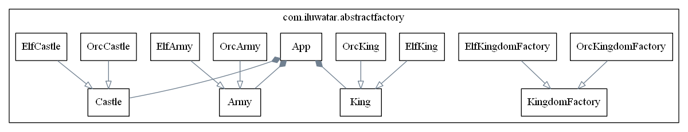

UML Reverse Mapper
===========================

Automatically generate [Graphviz](http://www.graphviz.org/) based class diagram from your code.

Using reflection, UML Reverse Mapper scans your packages that contain your code. It then builds a graph of class relations and outputs a Graphviz .dot file.

### Using from the command-line

Build the `urm-core` project with `mvn clean package` and grab the generated artifact `urm-core.jar`. Then you need the archive that will be analyzed. In this example we use `abstract-factory.jar` and assume the package name to be `com.iluwatar.abstractfactory`. Place the jar-files in the same directory and execute the following command.

    java -cp abstract-factory.jar:urm-core.jar com.iluwatar.DomainMapperCli -p com.iluwatar.abstractfactory

This will scan all classes under the package `com.iluwatar.abstractfactory` and output the .dot file to your console output. If you want to write it to file use switch `-f filename.dot`. If you need to scan multiple packages use format `-p "com.package1, com.package2"`. Note that under Windows OS the classpath separator is `;` instead of `:`;

### Using the Maven plugin

Add to your pom.xml the following:

	<build>
		<plugins>
			<plugin>
				<groupId>com.iluwatar</groupId>
				<artifactId>urm-maven-plugin</artifactId>
				<version>1.2.0</version>
				<configuration>
					<packages>
						<param>com.mycompany.mypackage</param>
						<param>com.mycompany.other_package</param>
					</packages>
					<ignores>
						<param>com.mycompany.mypackage.MyClass</param>
						<param>com.mycompany.other_package.OtherClass</param>
					</ignores>
				</configuration>
				<executions>
					<execution>
						<phase>process-classes</phase>
						<goals>
							<goal>map</goal>
						</goals>
					</execution>
				</executions>
			</plugin>
		</plugins>
	</build>

where the `packages` configuration parameter contains a list of packages that should be included in the class diagram and
the `ignores` configuration parameter contains a list of types that should be excluded from the class diagram.

When `process-classes` life-cycle phase gets executed, the class diagram will be saved to `/target/urm.dot`. Use this file with your local Graphviz or any of the online Graphviz tools to show your class diagram.
