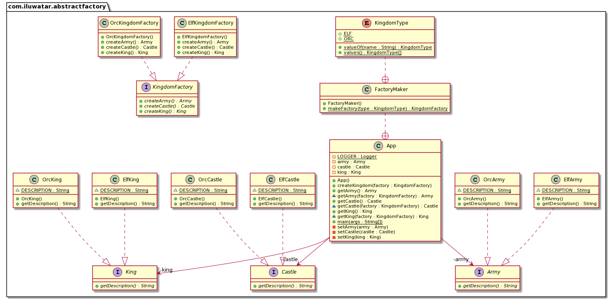
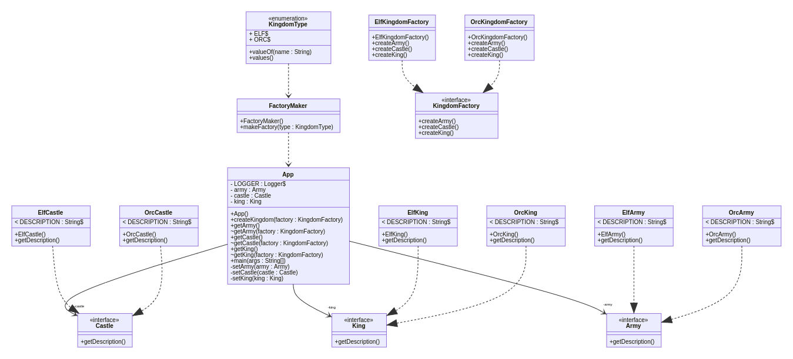

[](https://travis-ci.org/iluwatar/uml-reverse-mapper)
[](https://coveralls.io/github/iluwatar/uml-reverse-mapper?branch=master)
[](https://maven-badges.herokuapp.com/maven-central/com.iluwatar.urm/urm-maven-plugin/)
[](https://gitter.im/iluwatar/uml-reverse-mapper?utm_source=badge&utm_medium=badge&utm_campaign=pr-badge&utm_content=badge)

# UML Reverse Mapper

Automatically generate class diagram from your code.

Using reflection, UML Reverse Mapper scans your packages that contain your code. It builds the class relations and can output as a [Graphviz](https://www.graphviz.org/) .dot file, a [PlantUML](http://www.plantuml.com/) .puml file or a [Mermaid](https://mermaid-js.github.io/mermaid/#/)  .mmd file.

The tool is available in command line version (urm-core) and Maven plugin (urm-maven-plugin).

### Using from the command-line

Build the `urm-core` project with `mvn clean package` and grab the generated artifact `urm-core.jar`. Then you need the archive that will be analyzed. In this example we use `abstract-factory.jar` and assume the package name to be `com.iluwatar.abstractfactory`. Place the jar-files in the same directory and execute the following command.

    java -cp abstract-factory.jar:urm-core.jar com.iluwatar.urm.DomainMapperCli -p com.iluwatar.abstractfactory -i com.iluwatar.abstractfactory.Castle

This will scan all the classes under the package `com.iluwatar.abstractfactory` except `Castle` that was marked to be ignored and output the markup to your console output. By default PlantUML presenter is used, but it can be changed with switch `-s graphviz` or `-s mermaid`. If you want to write it to file use switch `-f filename`. If you need to scan multiple packages use format `-p "com.package1, com.package2"`. Note that under Windows OS the classpath separator is `;` instead of `:`

### Using the Maven plugin

Add to your pom.xml the following:
```xml
<build>
  <plugins>
    <plugin>
      <groupId>com.iluwatar.urm</groupId>
      <artifactId>urm-maven-plugin</artifactId>
      <version>2.0.0</version>
      <configuration>
        <!-- if outputDirectory is not set explicitly it will default to your build dir -->
        <outputDirectory>${project.basedir}/etc</outputDirectory>
        <packages>
          <param>com.mycompany.mypackage</param>
          <param>com.mycompany.other_package</param>
        </packages>
        <ignores>
          <param>com.mycompany.mypackage.MyClass</param>
          <param>com.mycompany.other_package.OtherClass</param>
        </ignores>
        <includeMainDirectory>true</includeMainDirectory>
        <includeTestDirectory>false</includeTestDirectory>
        <presenter>graphviz</presenter>
      </configuration>
      <executions>
        <execution>
          <phase>process-classes</phase>
          <goals>
            <goal>map</goal>
          </goals>
        </execution>
      </executions>
    </plugin>
  </plugins>
</build>
```

- `packages` configuration parameter contains a list of packages that should be included in the class
diagram 
- `ignores` configuration parameter contains a list of types that should be excluded from the class
diagram
- `Dependencies` list should contain the artifacts where the classes are found. See https://maven.apache.org/guides/mini/guide-configuring-plugins.html#Using_the_dependencies_Tag
- `includeMainDirectory` configuration parameter indicates to include classes of src/main/java 
directory. Default value of `includeMainDirectory` is true. 
- `includeTestDirectory` configuration parameter indicates to include classes of src/test/java 
directory. Default value of `includeTestDirectory` configuration parameter is false.
- `presenter` parameter control which presenter is used. Can be `graphviz`, `plantuml` or `mermaid`.

When `process-classes` life-cycle phase gets executed, the class diagram will be saved to the location specified by `outputDirectory` parameter. If not specified the file is saved
to `/target/${project.name}.urm.dot` or `/target/${project.name}.urm.puml`. Use this file with your local
or online tools to show your class diagram.

### Showcases

Here are some class diagrams generated with the `urm-maven-plugin`.





### Deploy Instructions

[Performing a Release Deployment](http://central.sonatype.org/pages/apache-maven.html#performing-a-release-deployment)

```
mvn clean deploy -P release
```

### Release notes

- 2.0.0
    - Add support for Mermaid presenter [#39](https://github.com/iluwatar/uml-reverse-mapper/pull/39)
    - Update to Java 11 [#42](https://github.com/iluwatar/uml-reverse-mapper/issues/42) and [#56](https://github.com/iluwatar/uml-reverse-mapper/pull/56)

- 1.4.8
    - Update dependencies to latest versions [#21](https://github.com/iluwatar/uml-reverse-mapper/issues/21)
    - Work on Java 11 compatibility [#18](https://github.com/iluwatar/uml-reverse-mapper/issues/18)
    - Create directories for the output file, if they don't exist

- 1.4.7
    - Update README.md instruction [#20](https://github.com/iluwatar/uml-reverse-mapper/issues/20)
    - Presenter can not be chosen via command line parameter [#22](https://github.com/iluwatar/uml-reverse-mapper/issues/22)
    - Presenter can not be chosen via plugin parameters [#23](https://github.com/iluwatar/uml-reverse-mapper/issues/23)
